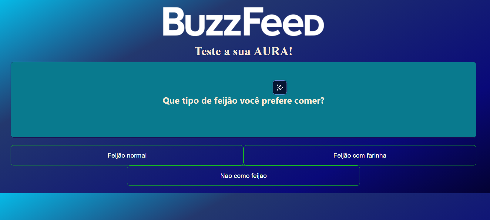
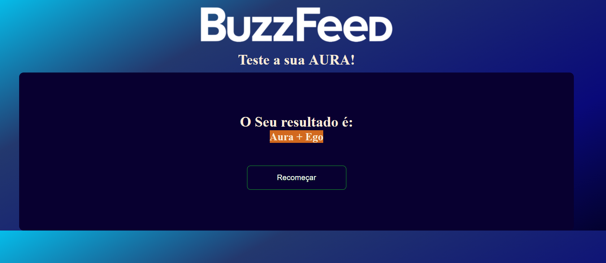

# 🧠 Angular BuzzFeed Quiz

An interactive BuzzFeed-style personality quiz built with **Angular**.

The application presents a sequence of questions inspired by Gen Z and Gen Alpha internet culture, calculates the most frequent answer category, and displays a personalized result with a smooth loading animation.

This project was originally developed during the **Santander Bootcamp (DIO)** and later expanded with new features and UI improvements.

---

## 🌐 Live Demo

🔗 https://quiz-aura-iota.vercel.app/

---

## 📸 Preview

### Question



### Loading Animation


### Final Result




---

## ✨ Features

- Dynamic quiz powered by JSON
- Personality result based on answer frequency
- Responsive layout
- Loading animation before displaying the result
- Restart quiz
- Easy quiz customization
- Mobile friendly

---

## 🛠️ Built With

- Angular
- TypeScript
- HTML5
- CSS3

---

## 🚀 Getting Started

### Clone the repository

```bash
git clone https://github.com/dhbart/angular-buzzfeed-quiz.git
```

### Enter the project

```bash
cd angular-buzzfeed-quiz
```

### Install dependencies

```bash
npm install
```

### Run the application

```bash
ng serve
```

Open your browser:

```
http://localhost:4200
```

---

## 📂 Project Structure

```
src/
│
├── app/
│   ├── components/
│   ├── pages/
│   └── ...
│
├── assets/
│   └── data/
│       └── quizz_questions_beta.json
│
└── ...
```

---

## ⚙️ Customization

All questions, answer mappings and final results are stored in:

```
src/assets/data/quizz_questions_beta.json
```

Changing this file is enough to create an entirely different quiz without modifying the application logic.

---

## 🧠 Result Algorithm

Each answer belongs to one of four categories:

- A
- B
- C
- D

At the end of the quiz the application:

1. Counts the occurrences of each category using a `Map`.
2. Finds the category with the highest frequency.
3. Displays the corresponding personality result.

In case of a tie, the first category that reached the highest score is selected.

---

## 📚 What I Practiced

- Angular Components
- Event Binding
- Property Binding
- Structural Directives
- State Management
- Dynamic Rendering
- JSON Data Handling
- TypeScript
- Responsive CSS
- Conditional Rendering
- User Experience improvements

---

## 🚀 Future Improvements

- Progress bar
- Sound effects
- Multiple quiz themes
- Dark Mode
- Social sharing
- Question animations
- Score history
- Randomized question order
- Backend persistence
- Unit tests

---

## 👨‍💻 Author

**Daniel Bartholdy**

- GitHub: https://github.com/dhbart
- LinkedIn: https://www.linkedin.com/in/daniel-bartholdy/

---

## 📄 License

This project was created for educational purposes during the Santander Bootcamp by DIO.
